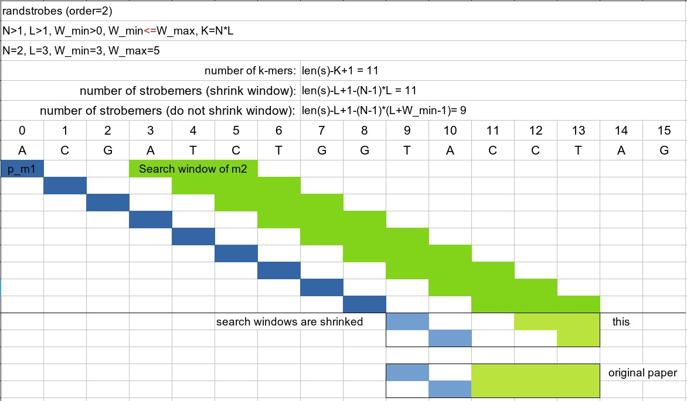
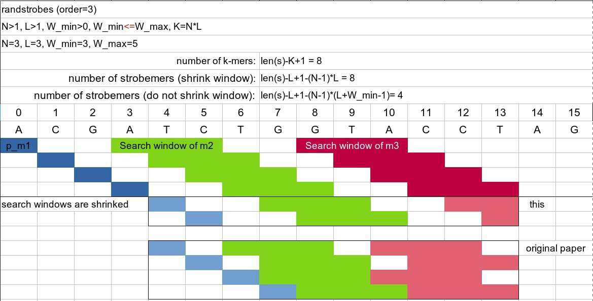

# Strobemers in Go

[](https://godoc.org/github.com/shenwei356/strobemers)
[](https://goreportcard.com/report/github.com/shenwei356/strobemers)

## Introduction

This is a Go implementation of the [strobemers](https://github.com/ksahlin/strobemers) (MinStrobes and RandStrobes),
with some [differences](#differences).

The implementation of `Randstrobes` has a not-bad performance (2-3X slower) compared to regular k-mer,
while it's 10-20X slower than [ntHash](https://github.com/will-rowe/nthash/). 
Besides `Randstrobes` is only slightly slower than `MinStrobes` (see [benchmark](#benchmark)).

#### Attention

Current implementation only compute strobemers of current strand,
because the strobes are asymmetrical and the location matters.

## Installation

    go get github.com/shenwei356/strobemers

## Quick Start

We followed the code style of [ntHash](https://github.com/will-rowe/nthash/).

```go
n := 2
l := 3
w_min := 3
w_max := 5
rs, err := strobemers.NewRandStrobes(seq, n, l, w_min, w_max)
checkError(err)

var hash uint64
var ok bool
var i int  // 0-based index
var positions []int // 0-based indexes of all strobes

rs.SetWindowShrink(true)
for {
    hash, ok = rs.Next()
    if !ok {
        break
    }

    i = rs.Index()
    positions = rs.Indexes()
}

```

## Differences

Differences compared to the original implementation

see discussion: [#1](https://github.com/ksahlin/strobemers/issues/1), [#2](https://github.com/ksahlin/strobemers/issues/2).

item                  |orginal                |this                              |comment
:---------------------|:----------------------|:---------------------------------|:---------------------------------------
window range          |`w_min < w_max`        |`w_min <= w_max`                  |allowing a fixed position
shrinking window      |all `w_min` and `w_max`|optional shrinking last `w_max`   |see figures below
number of strobemers  |`len(seq)-n*l+1`       |`len(seq)-n*l+1-(n-1)*l`          |window shrinked
number of strobemers  |                       |`len(seq)-n*l+1-(n-1)*(l+w_min-1)`|window not shrinked
choice of min hash    |`(h(m)+h(mj))%q`       |`(h(m)+h(mj))&q`                  |`&` is faster than `%`
final hash value (n=2)|h(m1)-h(m2)            |h(m1)/2+h(m2)/3                   |keep asymmetry and avoid uint64 overflow
final hash value (n=3)|h(m1)-h(m2)+2*h(m3)    |h(m1)/3+h(m2)/4+h(m3)/5           |~





## Benchmark

method                 |time  |relative_time
:----------------------|:-----|:------------
ntHashKmers(30)        |8590  |1
Kmers(30)              |55579 |6
MinStrobes(2,15,20,30) |104520|12
MinStrobes(3,10,20,30) |111662|13
RandStrobes(2,15,20,30)|93436 |11
RandStrobes(3,10,20,30)|152461|18

    $ go test . -bench=Benchmark* -benchmem \
        | grep Bench \
        | perl -pe 's/\s\s+/\t/g' \
        | csvtk cut -Ht -f 1,3-5 \
        | csvtk add-header -t -n test,time,memory,allocs \
        | csvtk pretty -t -r

                                     test           time       memory        allocs
    -------------------------------------   ------------   ----------   -----------
               BenchmarkNTHash/1.00_KB-16     8590 ns/op      48 B/op   1 allocs/op
                BenchmarkKmers/1.00_KB-16    55579 ns/op      32 B/op   1 allocs/op
     BenchmarkMinStrobesOrder2/1.00_KB-16   104520 ns/op   25064 B/op   7 allocs/op
     BenchmarkMinStrobesOrder3/1.00_KB-16   111662 ns/op   25064 B/op   7 allocs/op
    BenchmarkRandStrobesOrder2/1.00_KB-16    93436 ns/op    8432 B/op   3 allocs/op
    BenchmarkRandStrobesOrder3/1.00_KB-16   152461 ns/op    8432 B/op   3 allocs/op


## Similar Projects

- [strobemer_cpptest](https://github.com/BGI-Qingdao/strobemer_cpptest)

## References

- [ntHash](http://dx.doi.org/10.1093/bioinformatics/btw397)
- [strobemers](https://doi.org/10.1101/2021.01.28.428549)
